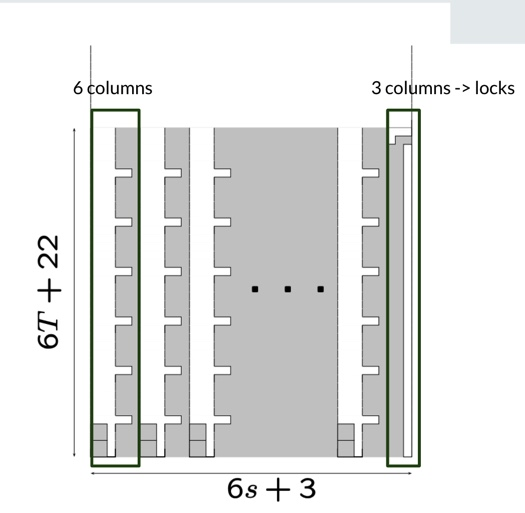

#### Proven by: Erik D. Demaine, Susan Hohenberger, and David Liben-Nowel
#### By: Helen Du, Lola Roberts, and Chris Tan


```{r, echo=FALSE, out.width = '50%'}
knitr::include_graphics("tetris.gif")
```


# 1. Introduction
Tetris was invented in the mid 1980's by Alexey Pazhitnov. By 1988, tetris was the best selling game in the United States and England; it had sold more than 50 million copies. Tetris has been one of the top selling games for the past 20 years.

## 1.1 Background 
In order to prove that tetris is NP complete, we are going to be looking at the offline version. We are using the offline version because it takes away the influence of reactions when calculating the NP hardness of the problem. The hardness of the offline version captures the hardness of the online game. The offline game also has some more constraints. For instance, all the pieces and their sequence are known in advanced before starting. Since the sequence is known we can organize all the pieces by their shape and give each shape an integer representation. Each piece can be classified with four attributes:

P = \<\ t, o, \<\ i, j \>\, f \>\


The t represents the type of piece, t ∈ {Sq, LG, RG, LS, RS, I, T}. The o represents the orientation o ∈ {0º, 90º, 180º, 270º}, the number of degrees clockwise from the piece’s base orientation (shown in Figure 1). The ⟨i,j⟩ is the position, <i,j> ∈ {1,...,m} × {1,...n} of the piece’s center on the gameboard. The f represents the value f ∈ {fixed,unfixed}, indicating whether the piece can continue to move or not.

The gameboard going to be m x n. m is the number of rows and n is the number of columns. The origin of the gameboard is going to be the bottom left corner, moving bottom to top and left to right. Differently from the online version of tetris, in order to clear the board, depending on the level you are on, you either have to clear the entire board at once or clear four rows at a time. Also, on easier levels, the gameboard is going to start completely empty, but on harder levels there will be pieces already on the board. 

# 2. Tetris Problem 
> Given a Tetris game G = < B, P1, P2, . . . , Pp>, does there exist a sequence of moves Σ that clears the entire gameboard of G? 

## 2.1 Tetris problem is NP-complete

### 2.1.1 Tetris problem is in NP
Given a sequence of moves, we can implement every single move in the sequence of moves and see if the gameboard is fulled filled or not.

### 2.1.2 Tetris problem is NP-Hard
##### - Prologue: Reduction from 3-Partition
3 Partition:
> Given a set of integers $a_1...a_{3s}$ that can be separated into s piles of three integers, where each pile has the same sum (Target T), such that every interger in the set satisfies T/4 < a_i < T/2.

Example:
+ Let $S_1$ = (1, 2, 3), T = 3, the input instance for 3 Partition is {1, 2, 3, 3} => False
+ Let $S_2$ = (2, 2, 2, 2, 2, 2), T = 6, the input instance for 3 Partition is {2, 2, 2, 2, 2, 2, 6} => True since we can split the set into two piles (2, 2, 2)(2, 2, 2).

##### - Interlude: 3-Partition is NP-Complete
Garey and Johnson (1975) originally proved 3-partition to be NP-complete, by a reduction from 3-dimensional matching. The classic reference by Garey and Johnson (1979) describes an NP-completeness proof, reducing from 3-dimensional matching to 4-partition to 3-partition. 

##### - Epilogue: Reduce Tetris Problem to 3-Partition
Given an arbitrary instance $P = <a_1, . . . , a_{3s}>$, T, of 3-Partition, we will produce a Tetris game G(P) whose gameboard can be completely cleared precisely if P is a “yes” instance. 

```{r, echo=FALSE, out.width = '50%'}

```

The initial gameboard is shown in the figure above. The topmost 3s + O(1) rows form an empty staging area for rotations and translations. Below, there are s buckets, each six columns wide, corresponding to the sets $A_1,....., A_s$ for the instance of 3-Partition. Each bucket has unfilled notches in its fourth and fifth columns in every sixth row, beginning in the fifth row. The first four rows of the first and second columns in each bucket are initially filled, and the sixth column of each bucket is entirely filled. The last three columns of the gameboard form a lock, blocking access to the last column, which is unfilled in all rows but the second-highest. Until a piece is placed into the lock to clear the top two rows, no lower rows can be cleared.

```{r, echo=FALSE,  out.width = '50%'}

```

The piece sequence consists of the following sequence of pieces for each $a_1,......, a_{3s}$: one initiator <I, LG, Sq>, then ai repetitions of the filler <LG, LS, LG, LG, Sq>, and then one terminator <Sq, Sq>. After the pieces associated with $a_1, . . . , a_{3s}$, we have the following additional pieces: s successive I’s, one RG, and 3T/2+5 successive I’s. (Without loss of generality, we can assume T is even by multiplying all input numbers by two.) The Tetris instance G(P) has size polynomial in the size of the 3-Partition instance P, since $a_1,....., a_{3s}$ and T are represented in unary, and can be constructed in polynomial time.

```{r, echo=FALSE, out.width = '80%'}

```

##### - Important Propositions
In any valid trajectory sequence:

1. no gridsquare above row 6T + 22 is ever filled;

2. all gridsquares of all pieces preceding the RG must all be placed into buckets, filling all empty bucket gridsquares;

3. no rows are cleared before the RG in the sequence;

4. all gridsquares of all pieces starting with (and including) the RG must be placed into the lock columns, filling all empty lock gridsquares;

5. no configuration with an unfillable bucket arises.

6. in an unprepped configuration, all pieces in the sequence I, LG, Sq, r×<LG, LS, LG, LG, Sq>, Sq, Sq, for any r ≥ 1, must be placed into a single bucket, yielding an unprepped configuration.

##### - If there is a valid trajectory sequence for G(P), then P is a “yes” instance of 3-Partition

Proof. If there is a valid strategy for G(P), then by Proposition 2, there is a way of placing all pieces preceding the RG to exactly fill the buckets. By Proposition 6, we must place all of the pieces associated with ai into the same bucket; by Proposition 1, we must have exactly the same number of filled gridsquares in each bucket. Define $A_j$ := {i : all the pieces associated with ai are placed into bucket j}. The total number of gridsquares placed into each bucket is the same; because every $a_i$ ∈ (T/4, T/2), we have that each |$A_j$ | = 3. Thus the $A_j$’s form a legal 3-partition, and P is a “yes” instance.

##### - Demo

```{r, echo=FALSE, out.width = '50%'}

```

```{r, echo=FALSE, out.width = '50%'}

```

```{r, echo=FALSE, out.width = '50%'}

```

```{r, echo=FALSE, out.width = '50%'}

```

```{r, echo=FALSE, out.width = '50%'}

```

```{r, echo=FALSE, out.width = '50%'}

```

```{r, echo=FALSE, out.width = '50%'}

```

```{r, echo=FALSE, out.width = '50%'}

```

## 2.2 Other objective: Maximizing the number of tetries (the number of times that four rows are cleared simultaneously) in a Tetris game is NP-complete.

```{r, echo=FALSE, out.width = '50%'}

```

This paper also proves that maximizing the number of tetrises (the number of times that four rows can be cleared simultaneously) in a Tetris game is NP complete. To prove this, we added 4 new rows below the original game board as shown in the figure. These 4 new rows are mostly filled except for one spot. Recall from the previous proof that in a yes instance of 3-PARTITION, no square above row 6T+22 is filled. Since 22 is not divisible by 4, in the original game board, we have at most (6T+20)/4 tetrises. Looking at the new rows, we can see that they could be cleared simultaneously by dropping an I shaped piece into the empty spot, which creates a tetrise. Therefore, here in a yes instance, we have at most (6T+20)/4 + 1 tetrises where the plus one comes from the 4 new rows. Since we have proven the original game board is NP complete, adding this new step still makes the game NP complete through proof by induction. 

# 3. Discussion

## 3.1 Application and Shortcomings

Intuitively, the offline version of Tetris is much easier than the online version due to the predictable sequence of pieces and many other restrictions. Therefore the difficulty of the offline version game implies the difficulty of the online version as well. So proving the offline version is NP complete gives us a sense of the hardness of the online version. Even though there are many previous works that have studied the possibility of perpetual loss-avoiding strategy in the online version, finding the optimal move through dynamic programming. According the the writers of the paper, this is the first consideration of the complexity of playing tetris, which is quite innovating and groundbreaking. The concept of the Tetris game also has many important applications in real life such packing a suitcase efficiently.  

```{r, echo=FALSE, out.width = '30%'}

```

## 3.2 Further Discussion

We chose this paper because this is such a popular game that most people grew up with it, and it would be interesting to relate this game that we are all familiar with to the computational theories we have learned in class. Overall, this paper gives a detailed proof of the NP completeness of the offline game Tetris as well as its extreme inapproximability. However, the main focus of the paper is the offline version of Tetris with many restrictions, which is quite different from the Tetris game that people have been playing for years. Some future directions could be consideration of the time complexity of the Tetris game with other conditions. For example, we could investigate what piece-set is Tetris solvable in polynomial time, the time complexity of Tetris with restricted game board size, and eventually the online version of the Tetris game.

# 4. Contribution

# 5. wReference

https://erikdemaine.org/papers/Tetris_COCOON2003/paper.pdf

https://www.cs.jhu.edu/~susan/600.363/tetris.pdf

https://www.cs.montana.edu/courses/spring2004/513/resources/BH03.pdf

https://arxiv.org/pdf/cs/0210020.pdf

https://www.wikiwand.com/en/Tetris

https://www.wikiwand.com/en/3-partition_problem
